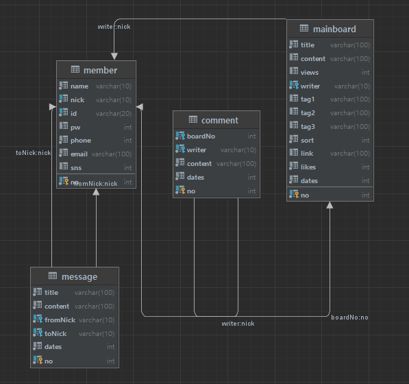
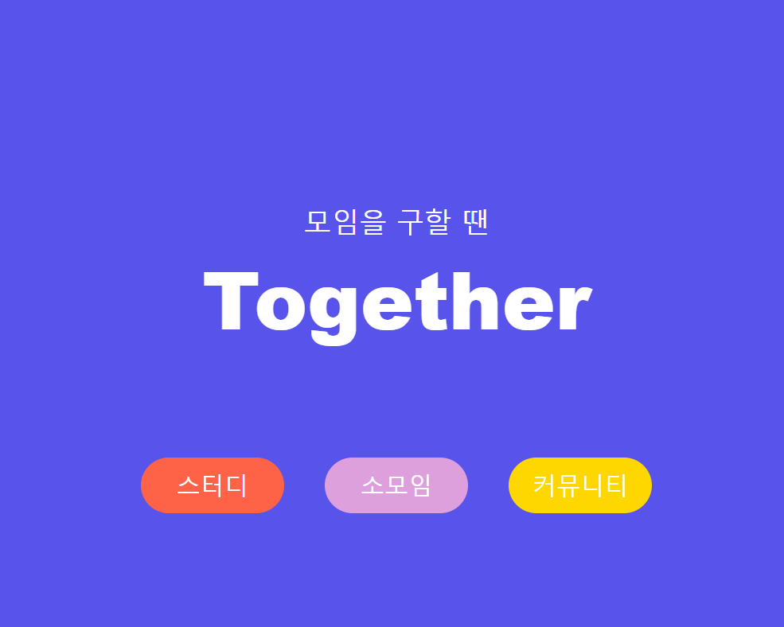
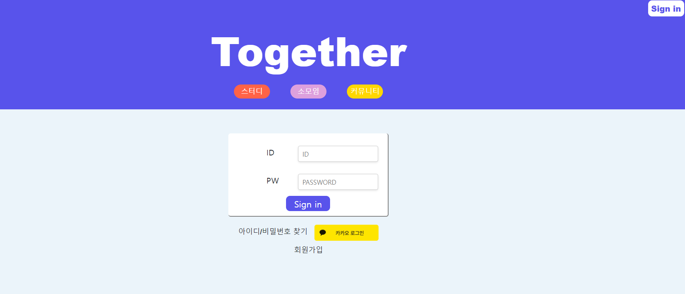
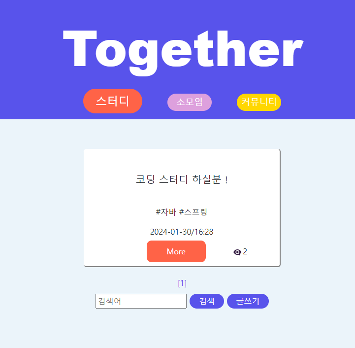
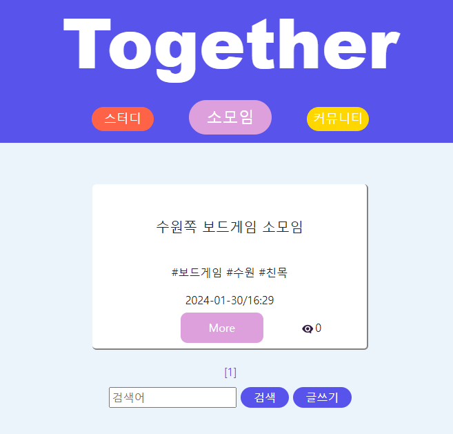
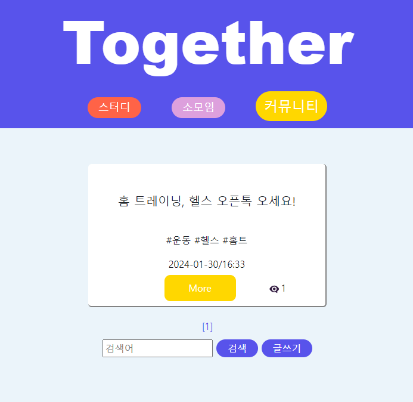
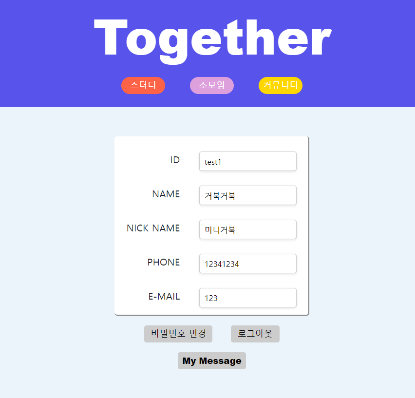
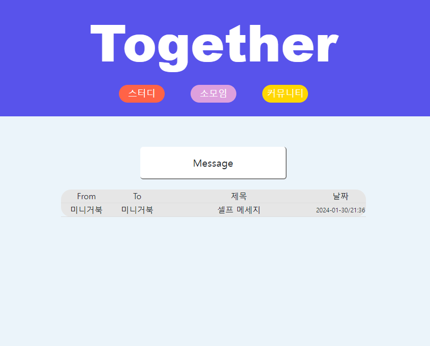
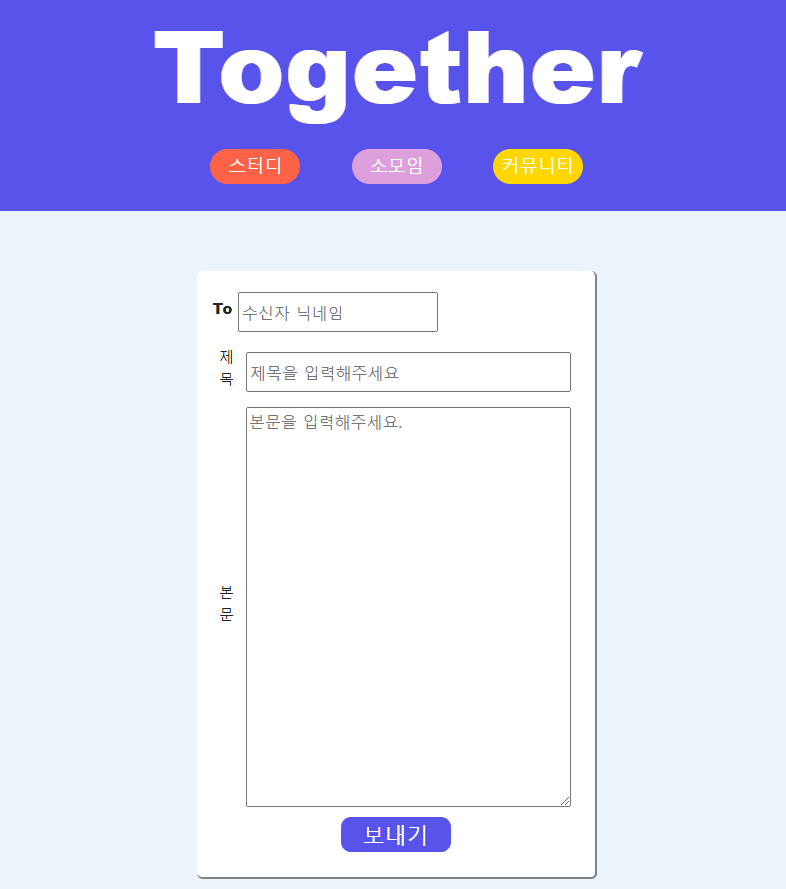

# Together (스터디 구인 웹 프로젝트)

# 제작 기간(2024 . 01 . 19 ~ 2024 . 01 . 30)  / 개인 프로젝트 (네 번째 프로젝트)

### 개발 환경 spring / thymeleaf / spring data jpa(+querydsl) / spring security / db-mysql

### 주제 = 스터디 / 소모임 / 커뮤니티 를 구하는 웹사이트를 제작  

### 사이트 주소 = http://togetherpj.kro.kr/home  

 
## ERD

## 홈화면

## 로그인 및 회원가입, 아이디 비밀번호 찾기

## 메인 화면. 스터디 / 소모임 / 커뮤니티 를 구하는 글이 있고 작성가능한 곳

## 마이 페이지와 내 메세지함, 그리고 메세지 보내는 화면

