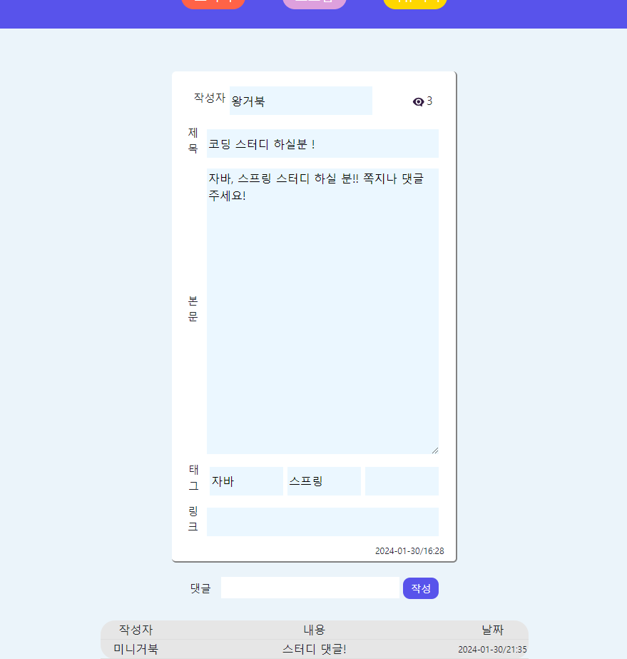

# Together (스터디 구인 웹 프로젝트)
  
# 제작 기간(2024 . 01 . 19 ~ 2024 . 01 . 30)  / 개인 프로젝트 (네 번째 프로젝트) 

### 개발 환경 spring / thymeleaf / spring data jpa(+querydsl) / spring security / db-mysql 
   
### 주제 = 스터디 / 소모임 / 커뮤니티 를 구하는 웹사이트를 제작       
   
### 사이트 주소 = http://togetherpj.kro.kr/ 현재 인스턴스 종료상태  

       

## 과정 및 후기
- Spring Security 적용 후 접근 권한 관리에서 자주 막혔었다, 단순한 src 경로를 열어주는 것 부터 이후 로그인 api 사용을 위한 url 접속까지 거의 모든 부분에서 에러를 만났고 덕분에 접근 권한관리에 좋은 경험을 얻었다. 

  
## ERD

      

## 홈화면

      

## 로그인 및 회원가입, 아이디 비밀번호 찾기

      

## 메인 화면. 스터디 / 소모임 / 커뮤니티 를 구하는 글이 있고 작성가능한 곳

      

## 마이 페이지와 내 메세지함, 그리고 메세지 보내는 화면

